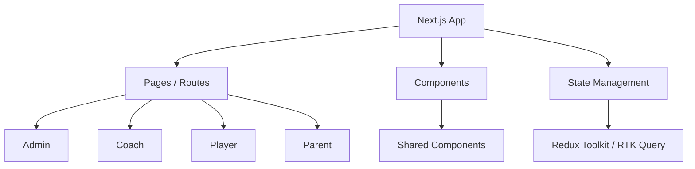
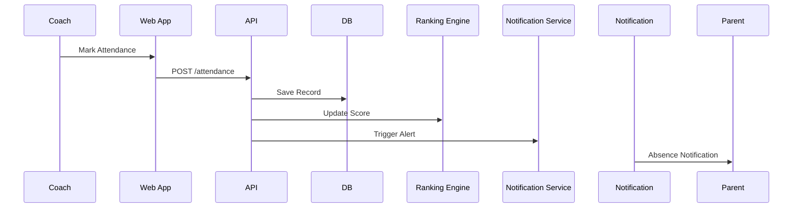
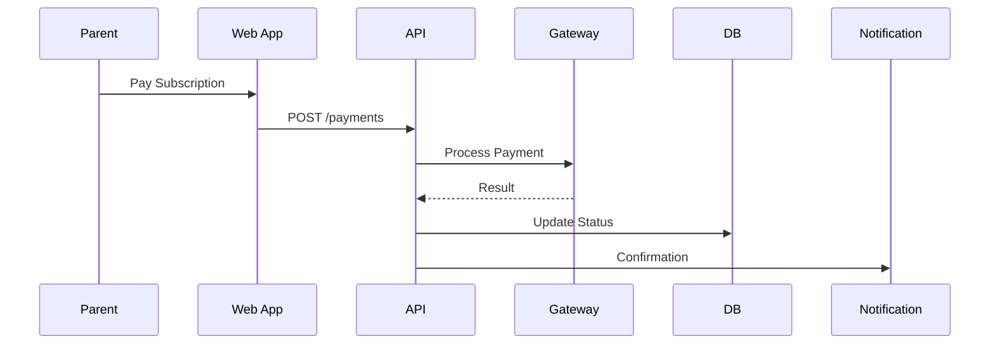
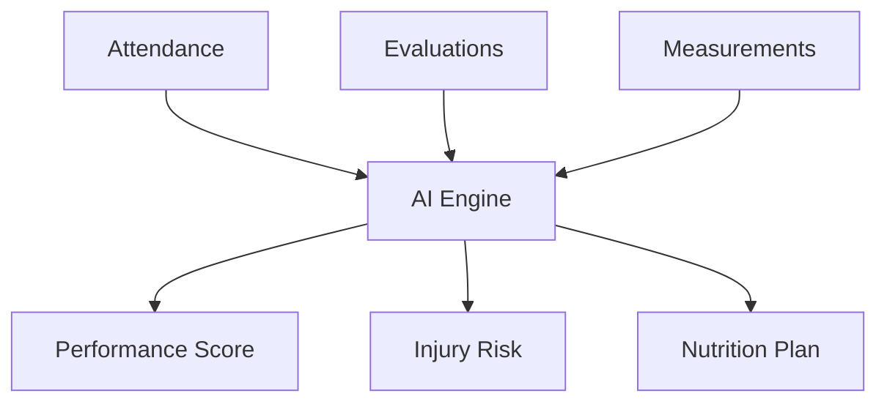

# GOALIX - Web-Based Sports Academy Platform

> A scalable, AI-powered web platform for managing sports academies, tracking performance, and enabling data-driven decisions.

## System Philosophy

```text
Data -> Processing -> Intelligence -> Decision
```

- Every interaction (attendance / evaluation / payments) is transformed into data.
- Data is processed into insights.
- Insights drive decisions (ranking / alerts / recommendations).

## High-Level Architecture (Web Only)

```mermaid
graph TD
A[Browser Client (Next.js)] --> B[API Gateway]

B --> C[Auth Service]
B --> D[User Service]
B --> E[Attendance Service]
B --> F[Ranking Engine]
B --> G[Payment Service]
B --> H[Notification Service]
B --> I[AI Services]

C --> DB[(PostgreSQL)]
D --> DB
E --> DB
F --> DB
G --> DB

DB --> R[(Redis Cache)]
DB --> S[(Cloud Storage)]

I --> ML[ML Models]
H --> EXT[SMS / WhatsApp APIs]
```

## Frontend Architecture (Important Update)



### Tech Decisions

- Next.js (App Router)
- Server Components + Client Components
- Redux Toolkit & RTK Query (data fetching and state management)
- Tailwind CSS

## Role-Based Routing Structure

```bash
/app
	/auth
	/admin
	/coach
	/player
	/parent
```

Each role has isolated UI + permissions.

## Core System Flows

### Attendance Flow



### Ranking Engine

```text
Score =
35% Evaluation +
20% Attendance +
15% Discipline +
20% Match +
10% AI
```

### Payment Flow



### AI Layer



## Database Design

```mermaid
erDiagram
ACADEMIES ||--o{ BRANCHES
BRANCHES ||--o{ GROUPS
GROUPS ||--o{ PLAYERS
GROUPS ||--o{ COACHES

PLAYERS ||--o{ ATTENDANCE
PLAYERS ||--o{ EVALUATIONS
PLAYERS ||--o{ MEASUREMENTS
PLAYERS ||--o{ PAYMENTS
PLAYERS ||--o{ RANKINGS
```

## Deployment Architecture (Web Focus)

```mermaid
graph TD
A[User Browser] --> B[CDN (Vercel / Cloudflare)]
B --> C[Next.js App]

C --> D[API Server]

D --> E[PostgreSQL]
D --> F[Redis]
D --> G[Storage]

D --> H[AI Services]

I[Monitoring] --> D
J[Logging] --> D
```

## Scalability Strategy

- SSR + ISR for performance
- API caching using Redis
- Lazy loading for dashboards
- Microservices-ready architecture (future scaling)
- CDN for static assets

## Security

- JWT authentication
- Role-based access control
- Secure cookies (httpOnly)
- Rate limiting
- Payment gateway protection

## Testing

- Unit testing (services)
- Integration testing (API)
- Role-based testing
- Load testing

## Roadmap

### Phase 1

- Core system (Web)
- Attendance + ranking
- Payments + notifications

### Phase 2

- AI systems
- Nutrition + media
- Coach analytics

### Phase 3

- Advanced analytics
- Multi-academy scaling

## Developer Notes

- Keep components reusable
- Separate business logic from UI
- Use API contracts strictly
- Optimize for dashboard performance

## Summary

GOALIX is:

> A fully web-based intelligent operating system for sports academies
