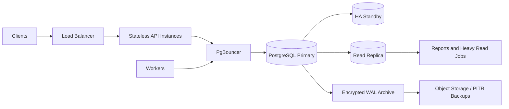

# Goalix Database Architecture — خطة 12 سنة وما بعدها

## 1. القرار التنفيذي

قاعدة Goalix الحالية مناسبة كنواة OLTP، ولا تحتاج sharding أو partitioning الآن. التحسين الصحيح هو:

1. الحفاظ على PostgreSQL كمصدر الحقيقة.
2. وضع PgBouncer أمام PostgreSQL عند تعدد الـ API instances.
3. ضبط connection budget مركزيًا بدل تكبير pool كل instance.
4. إبقاء الجداول التشغيلية صغيرة بسياسة Hot/Warm/Cold.
5. تفعيل قياس الاستعلامات الفعلي قبل إضافة أي index جديد.
6. الانتقال إلى partitioning لكل جدول على حدة عند وصوله إلى حجم أو تكلفة صيانة تبرر ذلك.
7. اعتماد توسعة/ترحيل/إزالة `expand -> migrate -> contract` لكل تغيير كبير.

التصميم طويل العمر لا يعني تثبيت نفس نسخة PostgreSQL أو نفس شكل الجداول 12 سنة. PostgreSQL يدعم كل major لمدة خمس سنوات تقريبًا، لذلك يلزم مسار ترقية مستمر. المرجع: [PostgreSQL Versioning Policy](https://www.postgresql.org/support/versioning/).

## 2. نتيجة التدقيق الفعلي

Snapshot بتاريخ 2026-07-02 بعد تطبيق migration `094_long_term_database_optimization.js`:

| البند | النتيجة |
| --- | ---: |
| PostgreSQL المحلي | 18.3 |
| نسخة Docker الإنتاج الحالية | 16 |
| حجم قاعدة التطوير | نحو 49 MB |
| الجداول | 110 |
| الأعمدة | 1325 |
| Foreign keys | 249 |
| Indexes | 487 |
| Migrations | 96/96 |
| Invalid indexes | 0 |
| Unvalidated constraints | 0 |
| جداول بدون Primary Key | 0 |
| مجموعات indexes متطابقة | 0 |
| FK بدون leading index | 62 للمراجعة، وليس للإضافة الآلية |

قبل التحسين كان يوجد 492 index و12 مجموعة متطابقة وconstraint غير validated. تمت إزالة الفهارس المتكررة، إضافة الفهارس المرتبطة بالاستعلامات الفعلية، وضبط autovacuum للجداول كثيرة التحديث.

الأرقام الحالية ناتجة من بيئة تطوير وليست capacity proof. صحة القرار في الإنتاج تعتمد على `pg_stat_statements` وload test وبيانات staging مماثلة للحجم المتوقع.

## 3. الشكل المستهدف



قواعد هذا الشكل:

- كل الكتابات والقراءات التي تحتاج read-after-write تذهب إلى Primary.
- التقارير الثقيلة والـ exports فقط يمكن نقلها إلى Read Replica.
- لا يُرسل ranking job إلى replica إذا كان سينتج snapshot بناءً على بيانات قد تتأخر بالـ replication.
- Workers لا تشارك نفس connection budget بلا حدود مع API.
- تشغيل migration يكون singleton قبل تشغيل نسخة التطبيق الجديدة.

## 4. Connection Budget

أخطر إعداد سابق كان `DB_POOL_MAX=40` في `.env.example`. مع 10 API instances كان يمكن أن يصل API وحده إلى 400 connection، بينما PostgreSQL المحلي مضبوط على `max_connections=100`.

المعادلة:

```text
usable_connections =
  max_connections
  - admin_and_migration_reserve
  - replication_and_maintenance_reserve

direct_pool_per_process <=
  floor(usable_connections / max_simultaneous_processes)
```

مثال بدون PgBouncer:

```text
max_connections = 100
reserve = 20
10 processes
direct pool max <= 8
```

الإعداد الافتراضي أصبح `DB_POOL_MAX=10` و`DB_POOL_MIN=0` في production compose، لكنه ليس رقمًا مقدسًا. عند 6–10 API instances يجب استخدام PgBouncer أو إعادة الحساب حسب `max_connections`.

### PgBouncer

الوضع المقترح هو `transaction` pooling للتطبيقات stateless، مع server pool مركزي مبني على قدرة PostgreSQL، وليس عدد المستخدمين. تعريف أوضاع pooling والحدود موضح في [PgBouncer Configuration](https://www.pgbouncer.org/config.html).

تنبيه: التطبيق يضبط `statement_timeout` و`lock_timeout` عند إنشاء الاتصال. Session-level settings لا يجوز الاعتماد عليها مع transaction pooling. قبل التحويل:

- اضبط timeouts كـ `ALTER ROLE ... SET` أو database defaults على PostgreSQL.
- اختبر transactions وprepared statements وmigrations عبر PgBouncer.
- اجعل migration تتصل مباشرة بالـ Primary أو pool منفصل بنمط session.

## 5. تقسيم الداتا منطقيًا

نحتفظ حاليًا بالجداول في `public` مع prefixes حتى لا نكسر routes أو migrations:

- Identity: `auth_*`, `iam_*`, `admin_*`.
- Academy: `academy_*`, `group_*`, `coach_*`, `player_*`, `parent_*`.
- Operations: `calendar_*`, `training_*`, `match_*`, `attendance_*`.
- Performance: `evaluation_*`, `ranking_*`, `injury_risk_*`, `ai_*`.
- Communication: `chat_*`, `notification_*`, `realtime_*`.
- Billing: `payment_*`.
- Storage and operations: `media_files`, `audit_logs`, `data_lifecycle_runs`.

لا توجد فائدة تبرر نقل 110 جدولًا الآن إلى PostgreSQL schemas منفصلة. الجداول الجديدة تستمر باستخدام prefix واضح، والملكية بين modules تُراجع في code review.

## 6. Multi-Tenancy

`academy_id` هو tenant key. القواعد للجداول الجديدة:

- كل aggregate أو fact يخص أكاديمية يحتوي `academy_id NOT NULL` ما لم تكن العالمية مقصودة.
- أول أعمدة index المعتادة تكون `(academy_id, ...)` عندما يكون الاستعلام tenant-scoped.
- أي uniqueness خاص بالأكاديمية يضم `academy_id`.
- لا نعتمد على UUID وحده كحد أمان؛ كل read/write حساس يظل academy-scoped.

بعض fact tables الحالية تصل للأكاديمية عبر joins، مثل attendance وranking. لا نكرر `academy_id` فيها فورًا لأن ذلك يحتاج ضمان consistency. عند الحاجة للشاردنج أو تقليل joins يتم التحويل online:

1. إضافة العمود nullable.
2. backfill على batches.
3. dual-write من التطبيق.
4. إضافة FK/check بـ `NOT VALID`.
5. التحقق ثم `VALIDATE CONSTRAINT`.
6. تحويله إلى `NOT NULL`.
7. إضافة indexes concurrently.

RLS يمكن إضافته كطبقة دفاع لاحقة، لكنه لا يُفعّل قبل اختبارات كاملة للـ workers والـ admin jobs والـ connection pooling.

## 7. تصميم المفاتيح

- UUID الحالي يبقى للـ business entities؛ لا يوجد مبرر لإعادة كتابة كل المفاتيح.
- الجداول append-only عالية الحجم تستفيد من sequence/bigint داخلي مرتب زمنيًا، مع UUID عام عند الحاجة.
- أي public id لا يحمل معنى business قابلًا للتغير.
- كل webhook/message/job قابل للإعادة يحتاج idempotency key وunique constraint.
- timestamps تظل `timestamptz` وتخزن UTC؛ التحويل إلى `Africa/Cairo` يكون عند العرض.

## 8. Index Architecture

### القواعد

- index يضاف لخطة استعلام حقيقية، لا لمجرد وجود عمود.
- ترتيب الأعمدة: equality ثم range ثم order.
- partial indexes للحالات النشطة مثل `deleted_at IS NULL` و`is_read = false`.
- expression indexes تستخدم فقط عندما يطابق expression الاستعلام حرفيًا.
- كل index له owner/query وسبب مكتوب في migration.
- الإنشاء والحذف على الجداول الكبيرة يتم `CONCURRENTLY`.

### Foreign keys

وجود FK بلا leading index لا يعني bug تلقائيًا. الفهرس مطلوب عندما:

- parent row يتعرض لـ delete/update.
- child rows تُقرأ بالـ FK.
- `CASCADE` أو `SET NULL` قد يمس عددًا كبيرًا.

الأعمدة من نوع `created_by`, `reviewed_by`, `marked_by` لا تُفهرس آليًا؛ كلفة الكتابة والتخزين قد تكون أكبر من delete نادر. أداة audit تعرض القائمة للمراجعة مع query stats.

### التحسينات المنفذة

- إزالة 14 index متكرر أو مغطى بالكامل.
- إضافة reverse lookup للـ coach/group وparent/player وIAM roles.
- إضافة indexes جزئية للـ legacy parent linkage.
- إضافة expression indexes لعمليات notification dedupe.
- إصلاح date filters لتستخدم half-open ranges:

```sql
start_datetime >= :date_from::date
AND start_datetime < (:date_to::date + interval '1 day')
```

هذا أفضل من:

```sql
start_datetime::date BETWEEN ...
```

لأن وضع function/cast على العمود يمنع استخدام B-tree index المعتاد بكفاءة.

## 9. Query Architecture

- كل list endpoint له limit ثابت ومحدود.
- chat والnotifications والaudit history تنتقل تدريجيًا إلى keyset pagination:

```sql
WHERE (created_at, id) < (:cursor_created_at, :cursor_id)
ORDER BY created_at DESC, id DESC
LIMIT :limit
```

- لا نستخدم deep `OFFSET` على جداول بعشرات الملايين.
- rankings المعروضة لكل الأدوار تُقرأ من snapshots، ولا يُستخدم live fallback الذي يحمل كل اللاعبين إلا كحالة طوارئ مقيدة.
- dashboard aggregates الثقيلة تُنقل إلى precomputed summaries أو materialized views بعد إثبات الضغط.
- كل query جديدة على hot path تُراجع بـ:

```sql
EXPLAIN (ANALYZE, BUFFERS, WAL, SETTINGS)
```

على بيانات staging، لا على قاعدة فارغة.

## 10. Hot / Warm / Cold Lifecycle

### Hot

الداتا المستخدمة يوميًا:

| الجدول | مدة Hot الحالية |
| --- | --- |
| `notification_inbox` | 4 شهور |
| `chat_messages` | 24 شهرًا |
| `audit_logs` | 18 شهرًا |
| `ai_analyses` | 18 شهرًا مع إبقاء أحدث نتيجة |
| `realtime_outbox` | 30 يومًا |
| `auth_refresh_tokens` | حذف بعد انتهاء الصلاحية + 30 يومًا |
| `auth_password_resets` | حذف بعد انتهاء الصلاحية + 30 يومًا |

Auth artifacts لا تُؤرشف لأنها secrets/credentials مشتقة ولا توجد قيمة تشغيلية للاحتفاظ بها طويلًا.

### Warm

Archive tables الحالية تقلل حجم الجداول الساخنة، لكنها ما زالت داخل نفس قاعدة البيانات ونفس backup. لذلك هي حل أداء، وليست حل تكلفة تخزين نهائيًا.

### Cold

قبل وصول archives إلى عشرات الجيجابايت:

- export سنوي أو ربع سنوي إلى Object Storage بصيغة مضغوطة.
- manifest يحتوي row count وchecksum وschema version.
- تشفير ومفاتيح منفصلة وسياسة وصول read-only.
- restore test دوري.
- الحذف النهائي يخضع لقرار قانوني/منتج لكل نوع بيانات.

## 11. Partitioning

لا partitioning الآن: القاعدة نحو 49MB، وإضافته مبكرًا يزيد تعقيد الـ PK/FK وmigrations والـ planner.

يبدأ تصميم partition خاص بجدول عندما يتحقق أكثر من مؤشر:

- الجدول أو فهارسه في نطاق عشرات الجيجابايت.
- retention delete أو vacuum أصبح عملية طويلة أو مولدة لـ WAL بكثافة.
- p95 ما زال أعلى من الهدف بعد إصلاح query/index.
- أغلب queries تحتوي date/period predicate يسمح partition pruning.

الـ 5M rows الموجود في lifecycle status هو alert للمراجعة، وليس أمر partition تلقائيًا. PostgreSQL نفسه ينصح باستخدام partitioning عندما يصبح الجدول كبيرًا فعليًا مقارنة بذاكرة الخادم وطبيعة الوصول: [PostgreSQL Declarative Partitioning](https://www.postgresql.org/docs/current/ddl-partitioning.html).

التوزيع المتوقع:

| الجدول | Partition key | البداية المقترحة |
| --- | --- | --- |
| `chat_messages` | `created_at` | شهري |
| `notification_inbox` | `created_at` | شهري |
| `audit_logs` | `created_at` | شهري/ربع سنوي |
| `player_daily_ai_inputs` | `input_date` | ربع سنوي |
| attendance facts | event date محفوظة على fact | سنوي أو ربع سنوي |
| ranking facts | period start | سنوي |

أي partitioned unique/primary key يجب أن يراعي partition key. الانتقال يكون عبر shadow table + dual write + backfill + controlled cutover، وليس `ALTER` مفاجئًا.

## 12. Autovacuum وBloat

migration `094` يضبط الجداول كثيرة التحديث:

- `auth_refresh_tokens`
- `notification_inbox`
- `realtime_outbox`
- `chat_conversations`

الإعدادات تستخدم scale factors أصغر و`fillfactor=90` لتقليل bloat ورفع فرصة HOT updates. لا يتم تشغيل `VACUUM FULL` آليًا لأنه يقفل الجدول. عند وجود bloat مثبت:

- `VACUUM (ANALYZE)` للصيانة العادية.
- `REINDEX CONCURRENTLY` لفهرس متضخم.
- `pg_repack` أو shadow migration فقط بعد runbook واختبار.

## 13. Observability

الحالة المحلية الحالية:

- `pg_stat_statements`: غير مثبت.
- `track_io_timing`: off.

قبل الإنتاج:

- تفعيل `pg_stat_statements` ومراقبة query id، total time، mean/p95 تقريبي، rows، temp IO.
- تفعيل `track_io_timing` بعد قياس overhead على نفس infrastructure.
- مراقبة connection saturation وlock waits وdeadlocks وreplication lag وWAL growth وautovacuum lag.
- حفظ query text في منصة logs بصلاحيات تمنع تسريب PII.
- تشغيل `npm run db:audit` بعد كل release ومراجعة `--strict` في CI على قاعدة migration جديدة.

مرجع القياس: [pg_stat_statements](https://www.postgresql.org/docs/current/pgstatstatements.html) و[Routine Vacuuming](https://www.postgresql.org/docs/current/routine-vacuuming.html).

## 14. HA وBackups

للإنتاج الحقيقي يفضّل Managed PostgreSQL Multi-AZ، أو إدارة Primary/Standby بأداة ناضجة، مع:

- WAL archiving وPITR.
- encrypted daily backups.
- RPO مستهدف 15 دقيقة.
- RTO مستهدف ساعتان.
- restore drill شهري أو ربع سنوي.
- backup قبل major migration.
- نسخة restore معزولة لاختبار migrations وintegrity.

Replica ليست backup. الخطأ المنطقي أو `DELETE` ينتقل إليها أيضًا.

## 15. سياسة النسخ والترقية

يوجد drift حاليًا: local PostgreSQL 18.3 وDocker production على major 16. لا نسمح بكتابة migration على 18 فقط ثم اكتشاف فشلها على 16.

المطلوب:

- CI يشغّل migrations/tests على أقل major مدعوم في production.
- staging يطابق production major/extensions/collation.
- تحديث minor خلال نافذة صيانة منتظمة.
- تخطيط major upgrade كل 2–3 سنوات، وقبل EOL بـ 12 شهرًا.
- اختبار `pg_upgrade` أو blue/green logical replication حسب الحجم.

حسب سياسة PostgreSQL الحالية، دعم major 16 ينتهي في نوفمبر 2028؛ لذلك لا يمكن أن يكون هو نسخة الـ 12 سنة.

## 16. Zero-Downtime Migrations

المسار الإجباري للتغييرات الكبيرة:

```text
Expand
-> deploy code compatible with old/new
-> backfill in bounded batches
-> validate
-> switch reads
-> contract in a later release
```

قواعد:

- `CREATE INDEX CONCURRENTLY`.
- FK/check جديدة بـ `NOT VALID` ثم `VALIDATE CONSTRAINT`.
- لا rename/drop في نفس release الذي يوقف القراءة القديمة.
- لا backfill ملايين الصفوف داخل transaction واحدة.
- `lock_timeout` قصير و`statement_timeout` معروف.
- migration قابلة للاستكمال بعد الفشل.
- لا يعاد تسمية migration مطبقة، حتى مع أرقام قديمة مكررة.

## 17. Capacity Model

يتم تحديث forecast كل ربع سنة:

```text
annual_rows =
  active_entities
  * events_per_entity_per_day
  * 365

annual_storage =
  annual_rows
  * (avg_heap_row_bytes + avg_index_bytes_per_row)
  * wal_and_backup_multiplier
```

يجب قياس `avg row size` وindex ratio من staging. عدد المستخدمين وحده لا يحدد حجم القاعدة؛ chat messages وnotifications وattendance cadence هي المحركات الحقيقية.

اختبار الحمل يتدرج 1k -> 5k -> 10k -> 16k -> 20k مع mixed workload، ثم soak test. النجاح يقاس latency وerror rate وDB saturation، لا بعدد requests فقط.

## 18. مراحل التنفيذ

### منفذ الآن

- إزالة duplicate/covered indexes.
- إضافة indexes للمسارات المقاسة.
- validation للـ FK المعلقة.
- تحسين date predicates.
- تحسين parent notification lookup.
- خفض pool الافتراضي من 40 إلى 10 وتحديد timeouts.
- purge للـ expired auth artifacts.
- ضبط autovacuum للجداول كثيرة التحديث.
- أداة `npm run db:audit`.

### قبل Production

- توحيد PostgreSQL major بين CI/staging/production.
- PgBouncer واختبار transaction pooling.
- `pg_stat_statements`.
- backup/PITR restore drill.
- load test ببيانات مماثلة.
- تحديد connection budget من hardware الفعلي.

### بعد ظهور نمو حقيقي

- keyset pagination للfeeds.
- read replica للتقارير.
- tenant key denormalization للجداول التي تحتاجه.
- partitioning جدولًا بجدول.
- cold archive خارج Primary.

## 19. أوامر التشغيل

```bash
cd golx-backend
npm run db:audit
npm run db:audit -- --json
npm run db:audit:strict
npm run data:lifecycle:report
npm run data:lifecycle:dry-run
npm run migrate
```

الخلاصة: Goalix جاهز للنمو إذا ظلت القرارات مبنية على قياس، وظلت الداتا الساخنة محدودة، وتمت ترقية PostgreSQL دوريًا. لا partitioning ولا sharding لمجرد توقع 12 سنة؛ نجهز مسارهما الآن ونفعّلهما عندما تثبت الأرقام الحاجة.
