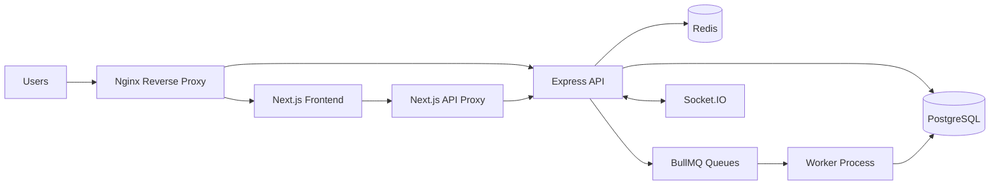
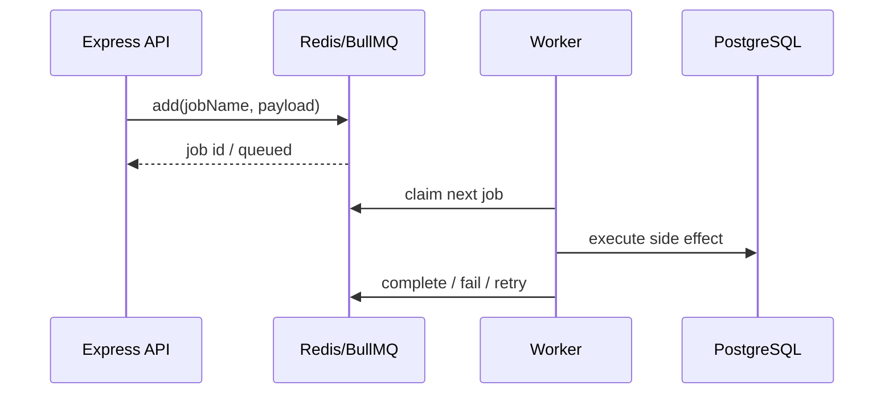
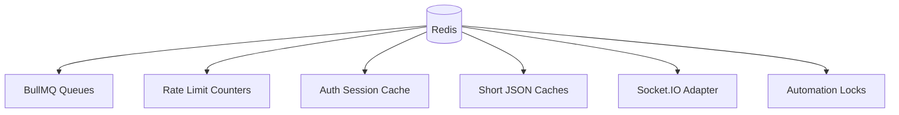
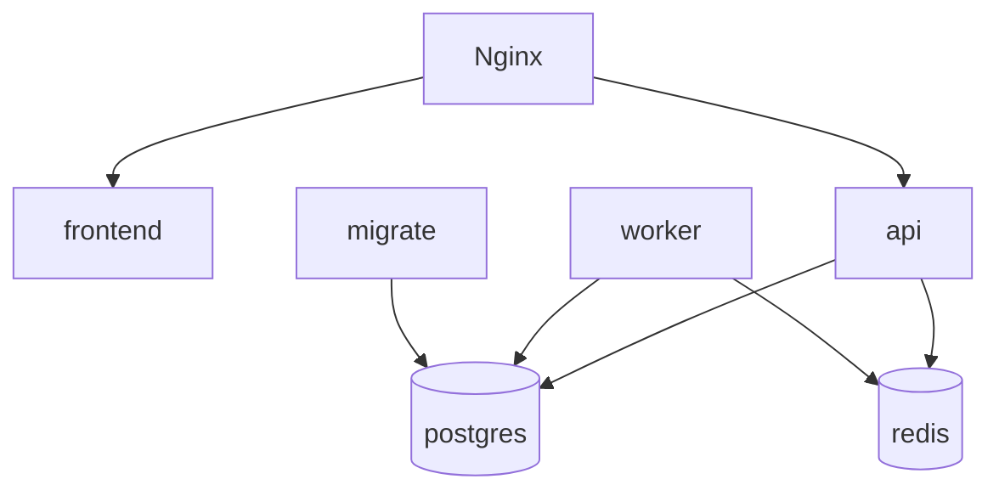

# Goalix Architecture Report - Mermaid Appendix

مهم: بناء على طلبك، الـ PDF لا يحتوي Mermaid code. هذا الملف فقط يحتفظ بالأكواد الخام لو احتجت تنسخها في draw.io أو Mermaid Live Editor أو GitHub.

## High Level System

## Queue Pipeline

## Redis Dependency Map

## Current Docker Topology

