# Goalix System Design

## 1. الهدف من الوثيقة

هذه الوثيقة تشرح تصميم نظام Goalix من منظور معماري وتشغيلي:

- ما هي مكونات النظام الرئيسية.
- كيف تتحرك البيانات بين الواجهة والباك اند وقاعدة البيانات.
- ما هي أدوار المستخدمين وحدود صلاحياتهم.
- كيف تعمل أهم الـ workflows: الدخول، MFA، اللاعبين، المدربين، التقويم، المباريات، التقييمات، الرانكينج، الحضور، الشات، الملفات، النوتيفيكيشن.
- ما هي نقاط الأمان والأداء والتشغيل الموجودة حاليا.
- ما هي الحدود والمخاطر التي يجب مراعاتها قبل الإنتاج.

الوثيقة تصف النظام الحالي بدون تغيير أي feature أو role أو workflow.

## 2. الملخص التنفيذي

Goalix هو Academy OS لإدارة أكاديمية كرة قدم. النظام مبني على:

- Frontend: Next.js App Router مع صفحات منفصلة حسب الدور.
- State/Data fetching: Redux Toolkit Query وبعض hooks مخصصة.
- Backend: Express.js API مقسم إلى modules.
- Database: PostgreSQL عبر Knex.
- Cache/Queues/Realtime: Redis, BullMQ, Socket.IO.
- Auth: JWT + cookies + DB sessions + CSRF + MFA للأدوار الإدارية.
- Storage: local في التطوير، وS3-compatible في production عبر storage adapter.

الأدوار الأساسية:

- Admin / Super Admin / Academy Owner / Staff custom roles.
- Coach بنوعين عمليين: Head Coach وAssistant Coach.
- Player.
- Parent / Guardian.

القاعدة العامة:

- كل دور يرى البيانات المسموح له بها فقط.
- Parent يرى اللاعبين المرتبطين بحسابه فقط.
- Coach يرى البيانات المرتبطة بتكليفاته فقط.
- Admin يرى ويدير نطاق الأكاديمية حسب صلاحياته.
- الملفات الحساسة لا يتم تحميلها مباشرة، بل من خلال protected proxy يتحقق من الصلاحية.

## 3. خريطة عالية المستوى

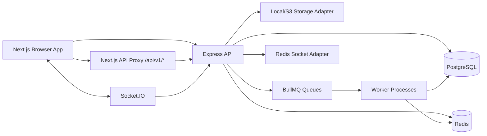

في الإنتاج المستهدف:

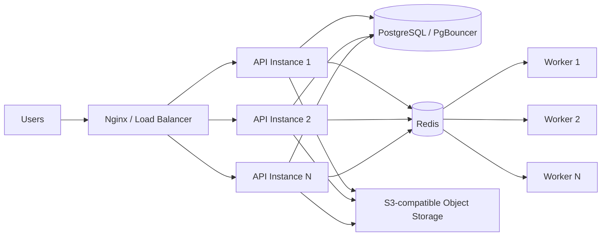

## 4. Frontend Architecture

### 4.1 التقنية

- Next.js App Router.
- Role-based route trees:
  - `app/admin/*`
  - `app/coach/*`
  - `app/player/*`
  - `app/parent/*`
  - `app/(auth)/*`
- Shared layout components:
  - `DashboardFrame`
  - `PortalSidebar`
  - `PortalTopNav`
  - role sidebars and headers.
- RTK Query APIs:
  - `adminApi`
  - `coachApi`
  - `calendarApi`
  - `academyApi`
  - `dashboardApi`
  - shared `baseQuery`.

### 4.2 مسؤوليات الواجهة

الواجهة مسؤولة عن:

- عرض dashboard المناسب للدور.
- إرسال cookies مع الطلبات.
- إدارة CSRF token للـ mutations.
- إعادة المحاولة مرة واحدة عند رفض CSRF بسبب token قديم.
- عرض states واضحة: loading, error, empty, unauthorized.
- عدم إظهار روابط أو صفحات غير مسموح بها للدور الحالي.
- الاتصال بـ Socket.IO للشات والنوتيفيكيشن عند الحاجة.

### 4.3 API Proxy

يوجد route في Next:

- `app/api/v1/[...path]/route.ts`

دوره تمرير طلبات frontend إلى backend مع الحفاظ على cookies وheaders المطلوبة. هذا يسمح للواجهة باستخدام مسار موحد `/api/v1/*` حتى لو تغير backend base URL.

## 5. Backend Architecture

### 5.1 Express App

الملف الرئيسي:

- `golx-backend/src/app.js`

ترتيب الباك اند العام:

1. تحميل env.
2. إنشاء Express app.
3. إضافة request id.
4. slow request logging.
5. security middleware:
   - Helmet
   - CORS
   - compression
   - hpp
   - cookie parser
6. CSRF cookie setup.
7. body parsers.
8. origin check للـ mutations.
9. CSRF middleware.
10. sensitive audit logging.
11. API rate limiting.
12. `/health`.
13. `/ready`.
14. `/api/v1/csrf-token`.
15. `/uploads/*` protected proxy.
16. mount application routes.
17. 404 handler.
18. error handler.

### 5.2 Bootstrap and Service Factory

الملف:

- `golx-backend/src/bootstrap/service-factory.js`

ينشئ:

- repositories.
- services.
- controllers.

النمط المستخدم:

```text
Controller -> Service -> Repository -> Database/Redis/Queue
```

الفائدة:

- فصل wiring عن business logic.
- تسهيل الاختبار.
- تقليل تضخم `app.js`.
- جعل أي refactor مستقبلي آمن لأنه يحافظ على نفس routes ونفس controllers.

### 5.3 Route Registry

الملف:

- `golx-backend/src/bootstrap/route-registry.js`

يركب routes التالية:

- `/api/v1/auth`
- `/api/v1/academy`
- `/api/v1/players`
- `/api/v1/coaches`
- `/api/v1/attendance`
- `/api/v1/rankings`
- `/api/v1/payments`
- `/api/v1/notifications`
- `/api/v1/ai`
- `/api/v1/chat`
- `/api/v1/admin`
- `/api/v1/coach`
- `/api/v1/player`
- `/api/v1/parent`

ويوجد legacy aliases:

- `/api/admin`
- `/api/coach`
- `/api/player`
- `/api/parent`

هذه aliases موجودة للحفاظ على التوافق، ولا يجب حذفها إلا بعد migration واضح.

## 6. Modules

### 6.1 Auth Module

المسارات:

- public player/parent login: `/api/v1/auth/login`
- admin/coach login: `/api/v1/auth/admin/login`
- refresh/session/me/logout.
- MFA setup/verify/disable/backup codes حسب الصلاحيات.

المسؤوليات:

- التحقق من username/password.
- إصدار JWT access/refresh.
- إدارة sessions.
- MFA للأدوار الإدارية.
- backup codes.
- lockout/rate limiting حسب الإعدادات.

### 6.2 Academy Module

يدير:

- إعدادات الأكاديمية.
- الفروع.
- system defaults.
- player options.
- roles/settings المرتبطة بالأكاديمية.

### 6.3 Admin Module

يدير:

- requests.
- roles and permissions.
- settings.
- coach assignment.
- operational overviews.
- reset password requests.
- MFA management للـ coaches/admins حسب الصلاحية.

### 6.4 Coaches Module

يدير:

- coach profiles.
- active/inactive status.
- head coach / assistant coach assignment role.
- coach assignment visibility.
- coach MFA setup by admin.

### 6.5 Players Module

يدير:

- player profile.
- basic info.
- guardian info قبل الربط بـ parent account.
- complete profile gate.
- parent linking.
- measurements/profile/ranking visibility.

### 6.6 Calendar Module

من أكبر modules في النظام.

يدير:

- training sessions.
- matches.
- schedules حسب الدور.
- match-day.
- match evaluation save/publish.
- ranking inputs الناتجة من training/match/evaluations.
- birth years/groups where applicable.

### 6.7 Attendance Module

يدير:

- attendance overview.
- QR attendance.
- event/session attendance.
- player attendance history.
- admin attendance details.

### 6.8 Rankings Module

يدير:

- weekly rankings.
- monthly rankings.
- player ranking history.
- position-based ranking.
- consistency بين admin/coach/player/parent.
- snapshots للفترات المكتملة.

### 6.9 Chat Module

يدير:

- conversations.
- messages.
- read receipts.
- attachments.
- Socket.IO realtime events.
- duplicate prevention via `clientMessageId` when available.

### 6.10 Notifications Module

يدير:

- unread count.
- list/read notifications.
- cleanup للقديم حسب retention policy.
- queue-driven notification jobs when enabled.

### 6.11 AI Module

يدير:

- injury risk insights.
- ranking model helpers.
- AI-related records.

يجب أن يظل الوصول إلى AI insights مربوطا بنفس access policy الخاصة باللاعب.

### 6.12 Payments Module

موجود في النظام، لكن أي refactor أو تغيير وظيفي في payments مؤجل حاليا حسب قرار المنتج.

## 7. Data Model Overview

الأسماء الدقيقة قد تختلف حسب migrations، لكن الصورة المنطقية كالتالي.

التصميم التفصيلي للنمو، connection pooling، الفهارس، الـ lifecycle، partitioning،
الترقيات وHA موجود في:

- `docs/database-architecture-long-term-ar.md`

### 7.1 Identity and Auth

| Entity | Purpose |
| --- | --- |
| `auth_users` | حسابات الدخول الأساسية لكل الأدوار |
| `sessions` / auth session tables | تتبع refresh/session state |
| `mfa_devices` | أجهزة authenticator المرتبطة بالحساب |
| `mfa_backup_codes` | backup codes hashed ومربوطة بحساب محدد |
| `roles` | roles system/custom |
| `permissions` | permission catalog |
| `role_permissions` | ربط role بالpermissions |
| `audit_logs` | تتبع عمليات حساسة ورفض الوصول |

### 7.2 Academy and Users

| Entity | Purpose |
| --- | --- |
| `academies` | الأكاديمية |
| `branches` | الفروع |
| `coach_profiles` | بيانات المدربين |
| `player_profiles` | بيانات اللاعبين |
| `parent_profiles` | بيانات أولياء الأمور |
| `parent_player_links` | ربط parent باللاعبين |
| `coach_assignments` | نطاقات تكليف الكوتش |

### 7.3 Football Operations

| Entity | Purpose |
| --- | --- |
| `birth_years` | الفئات العمرية وسنوات الميلاد |
| `groups` / teams | المجموعات/الفرق |
| `calendar_events` | أحداث التقويم العامة |
| `training_sessions` | تدريبات |
| `matches` | مباريات |
| `match_evaluations` | تقييمات المباريات |
| `attendance_records` | حضور اللاعبين |
| `measurements` | قياسات اللاعبين |

### 7.4 Rankings

| Entity | Purpose |
| --- | --- |
| `ranking_inputs` | inputs من التدريب/الماتش/التقييم |
| `weekly_ranking_snapshots` | ترتيب أسبوعي محفوظ |
| `monthly_ranking_snapshots` | ترتيب شهري محفوظ |
| `ranking_breakdowns` | تفاصيل النقاط والأسباب |
| `player_ranking_history` | تاريخ اللاعب عبر الأسابيع والشهور |

### 7.5 Realtime and Files

| Entity | Purpose |
| --- | --- |
| `chat_conversations` | المحادثات |
| `chat_participants` | أعضاء المحادثة |
| `chat_messages` | الرسائل |
| `chat_read_receipts` | حالة القراءة |
| `realtime_outbox` | أحداث realtime قابلة للإعادة |
| `notifications` | النوتيفيكيشن |
| `media_files` | metadata للملفات المرفوعة |

## 8. Authentication Flows

### 8.1 Player/Parent Login

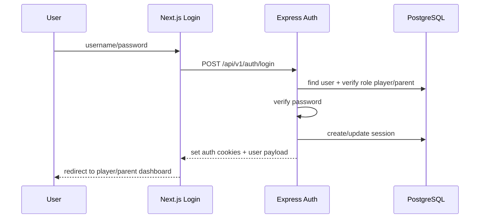

ملاحظات:

- هذا flow لا يندمج مع admin login.
- player/parent يستخدمان public login.
- redirect النهائي يعتمد على role.

### 8.2 Admin/Coach Login

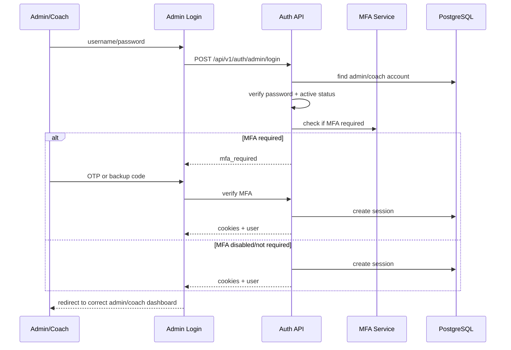

قواعد مهمة:

- Admin/Coach يدخلان من `/admin-login`.
- Admin/Coach يستخدمان `/api/v1/auth/admin/login`.
- تعطيل MFA لا يجب أن يغير role أو redirect.
- coach inactive لا يجب أن يدخل dashboard.
- coach unassigned لا يرى إلا المسموح له حسب assignment state.

### 8.3 MFA Management

الهدف:

- Admin يتحكم في MFA لنفسه وللمدربين.
- Coach لا يضيف جهاز MFA بنفسه إلا إذا تم السماح بذلك صراحة مستقبلا.
- Backup codes لكل حساب منفصلة.

Flow إضافة جهاز coach بواسطة admin:

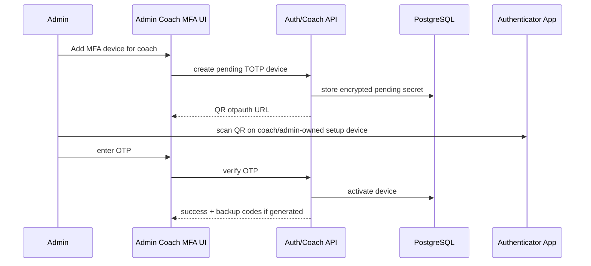

Label المطلوب في Authenticator:

- Admin: `Goalix Academy Admin`
- Coach: `Goalix Academy Coach`

Backup codes:

- تظهر مرة واحدة عند التوليد.
- تخزن hashed.
- يمكن للـ admin إعادة توليدها للـ coach.
- كود admin لا يعمل للـ coach، وكود coach لا يعمل للـ admin.

## 9. CSRF and Mutation Flow

كل POST/PUT/PATCH/DELETE يحتاج CSRF token.

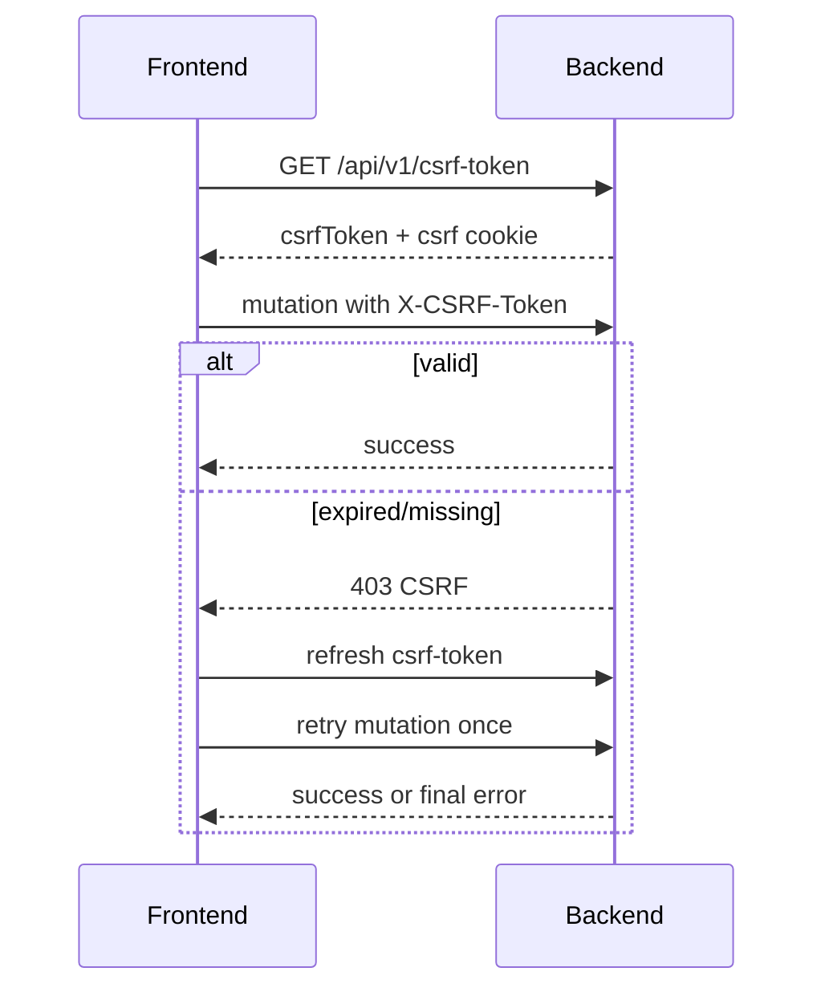

الهدف:

- منع CSRF attacks مع cookies.
- تقليل أخطاء المستخدم بسبب token قديم.
- عدم تكرار mutation أكثر من retry واحدة.

## 10. Authorization Design

### 10.1 RBAC

النظام يستخدم:

- role.
- permissions.
- middleware للتحقق.
- access policy helpers للموارد الحساسة.

الأدوار الكبيرة:

- Admin/Super Admin/Academy Owner/custom staff.
- Coach.
- Player.
- Parent.

قواعد:

- roles system يمكن جعلها read-only.
- custom roles يمكن تعديل permissions لها حسب rules.
- coach/player/parent لا يتم إدارتهم كـ staff roles عادية في صفحة roles إذا كان ذلك يخالف workflow.

### 10.2 Access Policy

المكان المنطقي:

- `golx-backend/src/shared/access-policy.js`
- `golx-backend/src/shared/upload-access.js`
- `golx-backend/src/shared/access-audit.js`

الموارد الحساسة:

- player profile.
- player rankings.
- player attendance.
- measurements.
- parent-child data.
- coach scoped players/groups.
- chat conversations.
- attachments/uploads.
- AI insights.

القاعدة:

```text
If access is not explicitly allowed, deny.
```

لكن يتم تطبيق ذلك بدون تغيير workflow الحالي.

### 10.3 Parent Visibility

Parent access flow:

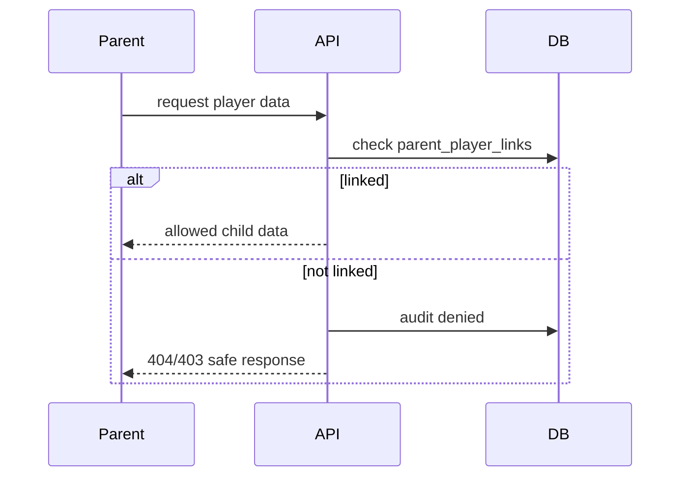

مهم:

- Parent A لا يرى Player B.
- نفس القاعدة تنطبق على profile, rankings, chat, attachments, AI insights.
- الرد يجب ألا يكشف هل اللاعب موجود أم لا عند عدم السماح.

### 10.4 Coach Scope

Coach access يعتمد على:

- active status.
- assignment.
- branch/group/birth year/player scope.
- head/assistant role.

Coach بدون assignment:

- لا يرى بيانات خارج المسموح.
- لا يدخل عمليات مرتبطة بتكليف غير موجود.

## 11. Core Workflows

### 11.1 Admin Adds Player

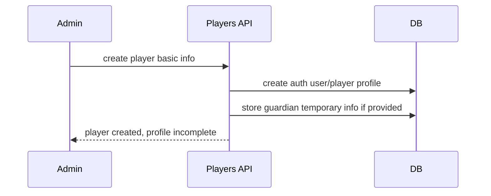

قواعد:

- اللاعب الجديد يحتاج complete profile قبل دخوله في operations حساسة.
- لا يدخل في group/match/training/model قبل اكتمال profile حسب strict mode.
- username لا يتغير بعد الإنشاء.
- password يمكن تغييره بواسطة admin عند reset request.
- photo field تم إزالته من add player حسب قرار المنتج.

### 11.2 Coach Adds Player

نفس فكرة admin add player لكن scoped حسب صلاحية coach.

Guardian data:

- تظهر مؤقتا في player profile.
- إذا تم ربط parent account باللاعب:
  - بيانات parent account تصبح المصدر الأساسي.
  - guardian temporary data لا تكون هي المعروضة الأساسية.

### 11.3 Parent Linking

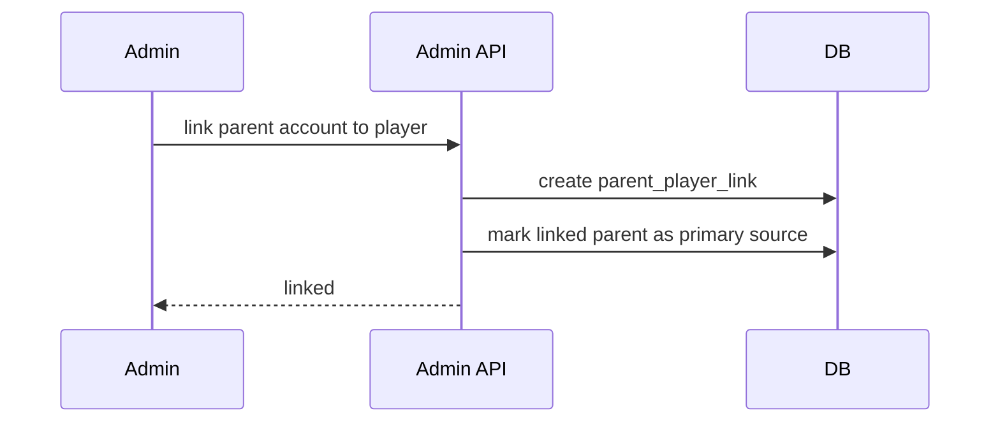

بعد الربط:

- parent يرى بيانات اللاعب.
- admin/coach يرى parent المرتبط وبيانات الحساب.
- guardian temp info لا تظل هي المصدر الرئيسي.

### 11.4 Coach Assignment

Admin يحدد:

- coach.
- branch/group/birth year/player scope.
- assignment role:
  - Head Coach.
  - Assistant Coach.

النتيجة:

- coach يرى فقط ما تم assign له.
- صفحة coach assignments تعرض التكليفات.
- coach غير active أو غير assigned لا يحصل على data غير مصرح بها.

### 11.5 Birth Years

Birth years تستخدم لتقسيم اللاعبين حسب سنة الميلاد/range.

قواعد:

- Admin يقدر ينشئ ويحذف حسب الصلاحية.
- Coach يقدر ينشئ birth years فقط في branches التي لديه access عليها.
- Coach يحذف فقط birth years التي أنشأها هو.
- لا يحذف birth years أنشأها admin أو أعطاه admin access لها.
- واجهة العرض توضح:
  - Created by admin.
  - Created by coach.
  - بألوان واضحة لتجنب اللبس.

### 11.6 Calendar and Schedule

كل دور يرى schedule مناسب:

- Admin: كل الأكاديمية حسب filters.
- Coach: تدريبات وماتشات scope الخاص به.
- Player: تدريبات وماتشات اللاعب.
- Parent: تدريبات وماتشات اللاعبين المرتبطين به.

Month overview:

- تقويم شهري كبير.
- أي training/match يظهر على اليوم الخاص به.
- باقي القائمة تعرض past/upcoming بشكل منظم.

### 11.7 Match Day Open Window

يوجد setting:

- `Match Day opens before kick-off`

المعنى:

- إذا القيمة 10، match day يفتح قبل موعد الماتش بـ 10 دقائق.
- يجب أن يقرأ match-day logic القيمة من System Defaults، وليس من مكان قديم في General Information.

### 11.8 Match Evaluation Save and Publish

Flow طبيعي:

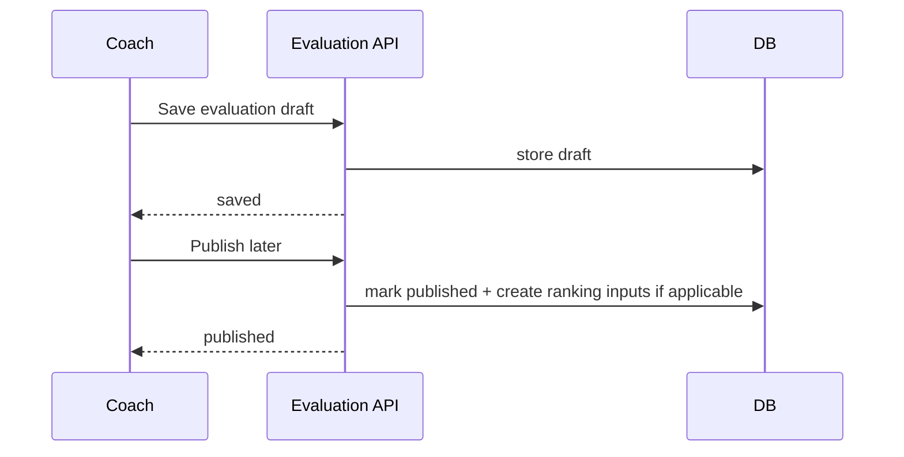

قواعد:

- Save لا يعني Publish.
- Coach يمكنه الحفظ ثم النشر لاحقا.
- Publish هو الذي يجعل التقييم مرئيا/مستخدما حسب workflow.

### 11.9 Attendance

مصادر الحضور:

- QR.
- Manual/admin/coach actions.
- Event/session attendance.

Admin attendance page يجب أن تعرض:

- اللاعب.
- الحدث/الماتش/التدريب.
- التاريخ.
- الحالة.
- طريقة التسجيل.
- coach/session context.
- branch/group when available.

### 11.10 Rankings

الرانكينج يعمل على فترات:

- أسبوعي.
- شهري.
- history.
- position-based.

القاعدة المطلوبة:

- كل أسبوع له inputs الخاصة به فقط.
- كل شهر له inputs الخاصة به فقط.
- الشهر الجديد يبدأ من صفر بالنسبة لحساب الشهر.
- الشهر السابق يظل محفوظا في history.
- الترتيب المعروض في admin/coach/player/parent يجب أن يأتي من نفس source/snapshot.

Weekly flow:

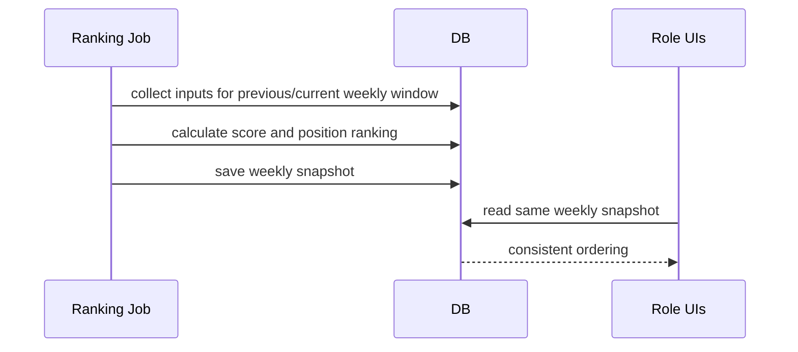

Monthly flow:

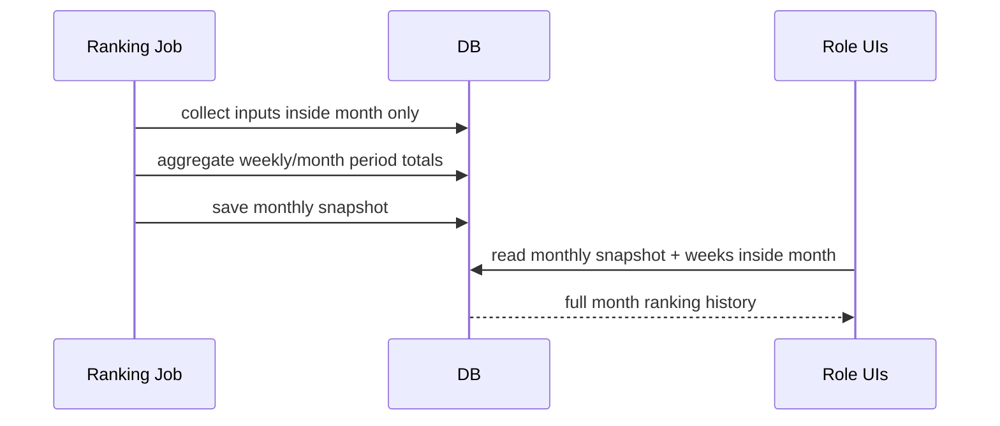

Admin history view المطلوب:

- كل شهر.
- داخل كل شهر الأسابيع الخاصة به.
- ترتيب كامل لكل اللاعبين في كل أسبوع.
- ترتيب الشهر الكامل.
- labels واضحة:
  - اسم الشهر.
  - رقم الأسبوع داخل الشهر.
  - date range.

### 11.11 Chat

Chat flow:

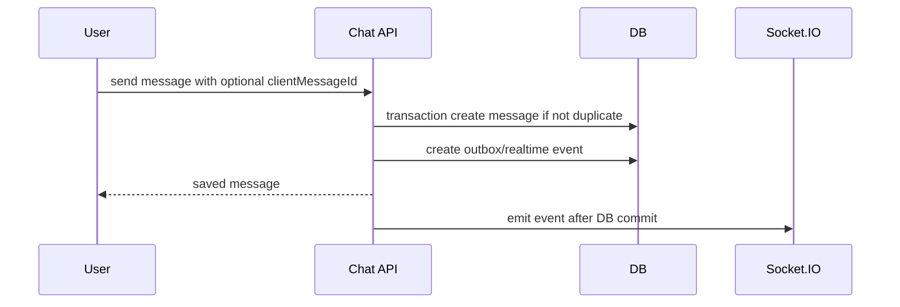

قواعد:

- DB-first ثم emit.
- `clientMessageId` يمنع duplicate عند retry.
- read receipts idempotent.
- attachments تتحمل عبر storage adapter وتظهر فقط لمن لديه access.
- Socket.IO 404 يعني غالبا السيرفر الذي تستهدفه الصفحة لا يشغل socket endpoint أو proxy غير موجه صح.

### 11.12 Notifications

Workflow:

```text
Business event -> notification service/job -> notifications table -> unread count/list -> mark read
```

سياسة التنظيف:

- النوتيفيكيشن القديمة أكثر من 4 شهور يمكن حذفها من DB حسب job/endpoint إداري.
- لا يتم حذف بيانات business الأصلية، فقط notification records القديمة.

### 11.13 Password Reset Requests

Flow:

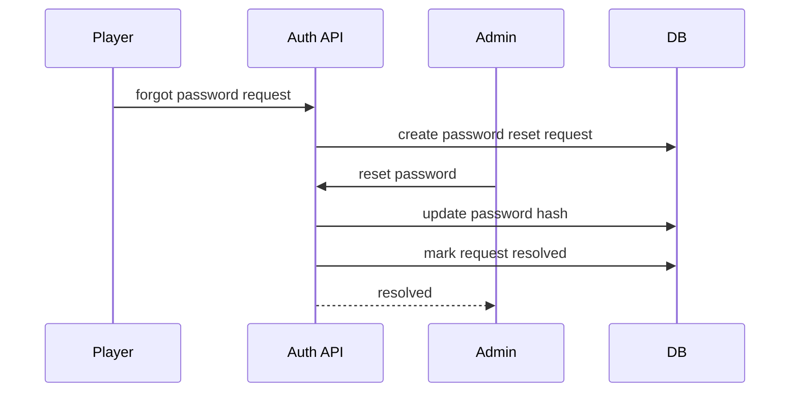

بعد resolved:

- زر Reset Password لا يفتح مرة أخرى لنفس الطلب.
- يظهر status واضح: password changed/resolved.

### 11.14 File Upload and Download

Upload flow:

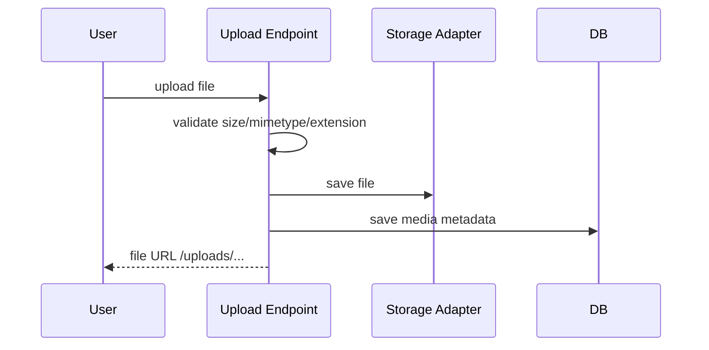

Download flow:

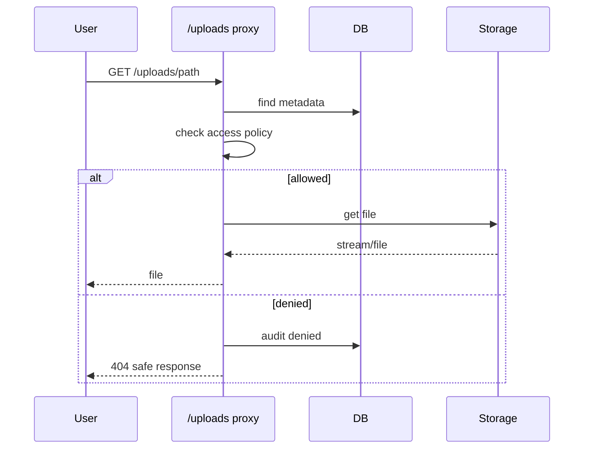

قواعد:

- الملفات الحساسة لا تخدم static مباشرة.
- يجب التحقق من الصلاحية قبل الإرسال.
- local في dev.
- S3-compatible في production.
- legacy uploads تظل تعمل لكن الهدف أن كل الملفات الجديدة لها metadata.

## 12. Realtime Design

المكونات:

- Socket.IO server.
- Redis adapter في حالة تعدد API instances.
- Chat realtime events.
- Notification realtime events.
- optional realtime outbox للأحداث المهمة.

قواعد reliability:

- event له `eventId`.
- client يعمل dedupe بالـ `eventId`.
- REST sync بعد reconnect يعيد الحالة الصحيحة.
- at-least-once delivery أفضل من فقد الحدث.

## 13. Background Jobs and Workers

Queues:

- rankings queue.
- notifications queue.
- payments queue.
- AI queue.

Workers:

- ranking worker.
- notification worker.
- payment worker.
- AI worker.

Production rule:

- API process لا يحمل workers الثقيلة داخله.
- workers تعمل كعمليات منفصلة.
- إذا Redis غير متاح:
  - API يظل يعمل للقراءات الأساسية حسب الإمكان.
  - `/ready` يرجع `degraded` إذا Postgres يعمل وRedis optional down.

## 14. Security Design

### 14.1 Existing Controls

- JWT cookies.
- DB-backed sessions.
- HttpOnly cookies.
- CSRF double-submit style.
- Origin checks.
- Helmet.
- CORS allowlist.
- hpp.
- body size limits.
- Rate limits.
- MFA للأدوار الإدارية.
- bcrypt password hashing.
- audit logs.
- protected uploads.
- production env validation.

### 14.2 MFA Controls

- Admin/Coach يمكن فرض MFA عليهم.
- TOTP secrets يجب أن تكون مشفرة app-level.
- Backup codes hashed.
- device revoke behavior واضح:
  - لا يتم حذف primary device إذا ذلك سيقفل الحساب بدون بديل إلا بقرار admin واضح.
- admin يستطيع manage coach MFA.

### 14.3 Authorization Risks Controlled By Policy

أخطر حالات يجب منعها:

- Parent A يرى Player B.
- Coach يرى player خارج assignment.
- Chat participant غير موجود يدخل conversation.
- Attachment URL يتسرب لشخص غير مصرح.
- AI insight يظهر لشخص لا يرى اللاعب.
- Player/Parent يدخلان admin endpoints.

### 14.4 Logging Without Leaking

- server logs تحتوي stack/details.
- production responses لا تكشف stack traces.
- denied access للموارد الحساسة يسجل audit.
- الرد للمستخدم يكون 404/403 آمن حسب الحالة.

## 15. Performance Design

### 15.1 Current Performance Strategy

- Pagination للـ endpoints الثقيلة.
- limit clamps لمنع `limit=1000/2000` بدون داعي.
- تقليل polling في الصفحات غير live.
- memoization للـ derived data في frontend عند الحاجة.
- slow request logging.
- slow query logging where configured.
- Redis cache لبعض القراءات الآمنة.

### 15.2 Hot Paths

أهم endpoints التي تحتاج مراقبة:

- rankings weekly/monthly/history.
- ranking-system-inputs.
- calendar/schedule.
- chat messages.
- notifications unread-count.
- attendance overview.
- player list/search.
- coach assignments.

### 15.3 Index Strategy

أي index جديد يجب أن يكون:

- additive.
- مبني على query فعلية.
- بعد `EXPLAIN ANALYZE`.
- لا يغير data shape.

أمثلة منطقية:

- chat messages by conversation/date.
- notifications by user/read/created.
- calendar events by academy/date/status.
- ranking snapshots by period/group/player.
- attendance by player/event/session.

### 15.4 Load Testing Target

هدف 10k-20k active users لا يمكن تأكيده من dev/local.

لازم staging-like:

- load balancer.
- 6-10 API instances حسب الموارد.
- workers منفصلة.
- PostgreSQL منفصل مع PgBouncer.
- Redis منفصل، وربما Redis للqueue وآخر للcache/socket عند الضغط.
- Object storage.
- load generator shards.

Success criteria المقترحة:

- HTTP error rate أقل من 0.5%.
- p95 reads أقل من 800ms.
- p95 writes أقل من 1500ms.
- p99 أقل من 3000ms.
- Socket connect success أعلى من 99%.

## 16. Observability and Operations

### 16.1 Health and Readiness

`GET /health`

- lightweight.
- يرجع ok لو process alive.

`GET /ready`

- يفحص PostgreSQL.
- يفحص Redis كاختياري.
- الحالات:
  - `ready`: Postgres وRedis جاهزين.
  - `degraded`: Postgres جاهز وRedis down.
  - `not_ready`: Postgres down.

### 16.2 Logs

مطلوب دائما:

- request id.
- method/url/status/duration.
- user id عند التوفر.
- slow request warning.
- denied access audit.
- worker job logs.

### 16.3 Backups and DR

سياسة production المقترحة:

- PostgreSQL encrypted backups.
- WAL archiving.
- Redis AOF backup إذا بيانات queue مهمة.
- monthly restore drill.
- RPO: 15 minutes.
- RTO: 2 hours.
- ممنوع استخدام production SQL dump في dev بدون sanitize/anonymize.

## 17. Deployment Design

### 17.1 Development

```text
Next.js dev server
Express API
PostgreSQL
Redis optional/degraded
Local storage
```

### 17.2 Production Target

```text
Nginx/LB
API instances
Worker instances
PostgreSQL + PgBouncer
Redis
S3-compatible object storage
TLS
Backup jobs
Monitoring/logging
```

### 17.3 Environment Variables Categories

- Database:
  - `DATABASE_URL`
- Redis:
  - `REDIS_URL`
- JWT:
  - `JWT_ACTIVE_KID`
  - `JWT_SECRET`
  - `JWT_SECRET_PREVIOUS`
- Cookies/CSRF:
  - `COOKIE_SECRET`
  - `CSRF_SECRET`
- MFA:
  - `MFA_ENFORCED_ROLES`
  - encryption secret for TOTP if configured.
- Storage:
  - `STORAGE_PROVIDER`
  - `S3_ENDPOINT`
  - `S3_BUCKET`
  - `S3_ACCESS_KEY_ID`
  - `S3_SECRET_ACCESS_KEY`
- Backups:
  - `BACKUP_*`

Production يجب أن يفشل fast إذا secrets أو storage config ناقصة.

## 18. Role Dashboards

### 18.1 Admin

Admin dashboard يشمل:

- requests.
- academy.
- coaches.
- players.
- parents.
- calendar.
- matches.
- attendance.
- rankings.
- payments.
- notifications.
- reports.
- settings.
- help.

Admin يرى full operational details حسب صلاحياته.

### 18.2 Coach

Coach dashboard يشمل:

- home.
- calendar.
- birthdays/birth years حسب access.
- my groups.
- matches.
- evaluations.
- assignments.
- measurements.
- rankings.
- injury risk AI.
- chat.
- notifications.

Coach يرى فقط scope الخاص به.

### 18.3 Player

Player dashboard يشمل:

- home.
- profile.
- calendar.
- training.
- matches.
- attendance.
- assignments.
- performance/ranking.
- notifications.
- chat.
- settings/help.

Player يرى بيانات نفسه فقط.

### 18.4 Parent

Parent dashboard يشمل:

- home.
- child selector.
- schedule.
- matches.
- payments.
- rankings/performance للطفل.
- notifications.
- chat/help.

Parent يرى الأبناء المرتبطين فقط.

## 19. Important End-to-End Flows

### 19.1 New Player to Active Operations

```text
Admin/Coach creates player
-> player profile incomplete
-> coach/admin completes required profile fields
-> player becomes eligible for group/match/training/model operations
-> parent account can be linked later
-> linked parent becomes guardian source
```

### 19.2 Training to Ranking

```text
Coach creates training
-> players attend / get evaluated
-> ranking inputs created for that week
-> weekly ranking job calculates snapshot
-> monthly job aggregates month-only inputs
-> admin/coach/player/parent read same snapshots
```

### 19.3 Match to Published Evaluation

```text
Match created
-> match day opens before kickoff by configured minutes
-> coach records evaluation
-> save draft
-> publish later
-> published evaluation contributes to visibility/ranking as configured
```

### 19.4 Chat With Attachment

```text
User joins allowed conversation
-> uploads attachment through backend
-> metadata saved
-> message saved with attachment URL
-> event emitted after DB commit
-> recipient downloads through /uploads proxy
-> proxy checks conversation/attachment access
```

### 19.5 Reset Password Request

```text
Player clicks forgot password
-> request appears in admin requests
-> admin resets password
-> request status resolved
-> reset button disabled/hidden
-> player logs in using new password
```

## 20. Known Boundaries and Risks

هذه ليست بالضرورة bugs، لكنها نقاط يجب مراقبتها:

- تأكيد تحمل 20k active users يحتاج staging load test، ولا يمكن إثباته محليا.
- payments مؤجلة حاليا من ناحية refactor.
- أي legacy upload بدون metadata يحتاج fallback محدود وآمن.
- Socket.IO يحتاج proxy/LB configuration صحيح لتجنب 404 أو disconnects.
- Redis down يجب ألا يسقط API بالكامل، لكنه سيؤثر على queues/realtime/cache.
- ranking correctness يعتمد على أن كل فترة تستخدم inputs الخاصة بها فقط.
- أي توسيع في permissions يجب أن يمر عبر access policy tests.
- SQL dumps الحقيقية خطر كبير ويجب sanitize قبل أي handover.

## 21. Recommended Next Phases

### Phase 1: Documentation and Regression Safety

- تثبيت هذه الوثيقة كمرجع.
- إضافة tests لأهم flows:
  - auth split login.
  - parent visibility.
  - coach assignment.
  - MFA admin-managed coach.
  - CSRF.
  - upload access.
  - rankings consistency.

### Phase 2: Access Policy Completion

- التأكد أن كل endpoints الحساسة تستخدم policy helpers.
- audit denied access في parent/chat/uploads/AI/rankings.

### Phase 3: Storage Metadata Migration

- كل uploads الجديدة تسجل metadata.
- أدوات migration تدريجية للملفات القديمة إن لزم.

### Phase 4: Ranking Snapshot Hardening

- مصدر واحد للترتيب في كل الأدوار.
- history واضح بالشهور والأسابيع.
- tests للفواصل الزمنية.

### Phase 5: Load Testing

- mixed workload harness.
- 1k -> 5k -> 10k -> 16k -> 20k.
- fixes مبنية على measurements فقط.

### Phase 6: Production Readiness

- Docker/VPS deployment docs.
- backup/restore drill.
- secret rotation.
- monitoring/alerts.
- TLS and object storage.

## 22. Summary

Goalix معماره الحالي مناسب للتطوير التدريجي إذا تم الحفاظ على هذه القواعد:

- لا route breaking changes.
- لا تغيير roles أو workflows بدون قرار منتج واضح.
- كل access حساس يمر عبر policy.
- الملفات الحساسة لا تخدم static.
- ranking source واحد لكل الأدوار.
- backend يقبل scaling أفقي عبر API instances وworkers منفصلة.
- Redis degradation لا يسقط النظام بالكامل.
- الأداء يقاس قبل أي optimization.

هذه الوثيقة يجب أن يتم تحديثها كلما تغير flow أو module مهم، لأنها تمثل الخريطة التشغيلية للنظام.
